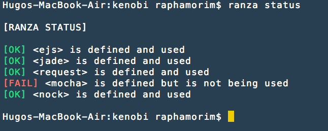

# Ranza (UNSTABLE)

> The npm butler

Search all your requires in the project and manages what is missing in `package.json` file. Or rather: Search for unidentified dependencies in `package.json` and notifies you

Don't be shy, send a Pull Request :)

## Install

Before anything, you need to have [node](http://nodejs.org/) and [npm](https://www.npmjs.org/) installed.

```sh
$ npm install -g ranza
```

## Usage

#### Status (stable)

Run in folder root to get the status from all dependencies in `package.json`

```sh
$ ranza status
```

Example: 



#### Install (unstable)

Search and install all requires dependencies in `package.json` without save:

```sh
$ ranza install
```

Search and install all requires dependencies in `package.json` saving as dependencies:

```sh
$ ranza install --save
```

Search and install all requires dependencies in `package.json` saving as devDependencies:

```sh
$ ranza install --save-dev
```

## History

See [Changelog](docs/changelog.md) for more details.

## Contributing

1. Fork it!
2. Create your feature branch: `git checkout -b my-new-feature`
3. Commit your changes: `git commit -m 'Add some feature'`
4. Push to the branch: `git push origin my-new-feature`
5. Submit a pull request :D

## About

**License:** MIT ® [Raphael Amorim](https://github.com/raphamorim)