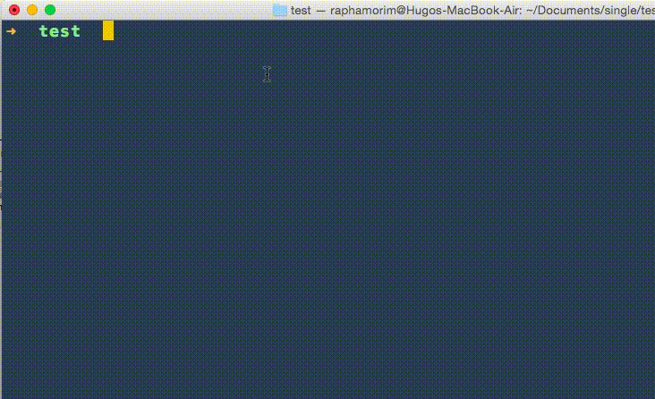
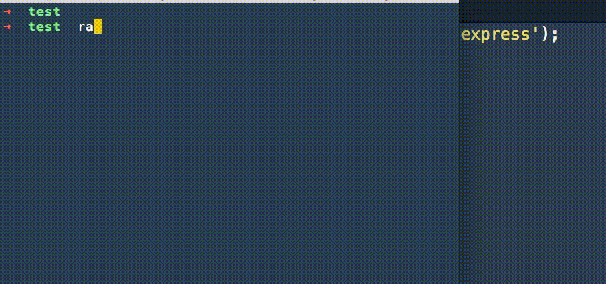

# Ranza

> The npm's butler

Quickly spot any dependency required in the project and not listed in `package.json`. And also the other way around: quickly remove listed dependencies that are being used.

Run whenever you need or use the `watch` command to install dependencies automatically as you write `require`s on your project.

A simple **status** example:



## Install

With [node](http://nodejs.org/) and [npm](https://www.npmjs.org/) installed, install ranza with a single command:

```sh
$ npm install -g ranza
```

## Usage

#### Status

Checks all project for required dependencies and confirms if they are listed on `package.json`:

```sh
$ ranza status
```

#### Install

Installs all dependencies required throughout the project, but do not save them in `package.json`:

```sh
$ ranza install
```

Installs all dependencies required throughout the project and add them to `package.json` as `dependencies`:

```sh
$ ranza install --save
```

Installs all dependencies required throughout the project and save them in `package.json` as `devDependencies`:

```sh
$ ranza install --save-dev
```

#### Clean

Remove and clean all unused dependencies from `package.json`:

```sh
$ ranza clean
```

#### Watch (only for HARDCORE developers)

**The not recommended way:**

> Installs every single dependencies in each livereload

Livereload in all files, installing undefined dependencies without saving them in `package.json`:

```sh
$ ranza watch
```
 
**The recommended way:**

> Installs only missed dependencies in each livereload

Livereload in all files, installing undefined dependencies and saving them as `dependencies` in `package.json`:

```sh
$ ranza watch --save
```

Livereload in all files, installing undefined dependencies and saving them as `devDependencies` in `package.json`:

```sh
$ ranza watch --save-dev
```

Example: 



## History

See [Changelog](docs/changelog.md) for more details.

## Contributing

Don't be shy, send a Pull Request! Here is how:

1. Fork it!
2. Create your feature branch: `git checkout -b my-new-feature`
3. Commit your changes: `git commit -m 'Add some feature'`
4. Push to the branch: `git push origin my-new-feature`
5. Submit a pull request :D

## About

**License:** MIT ® [Raphael Amorim](https://github.com/raphamorim)
